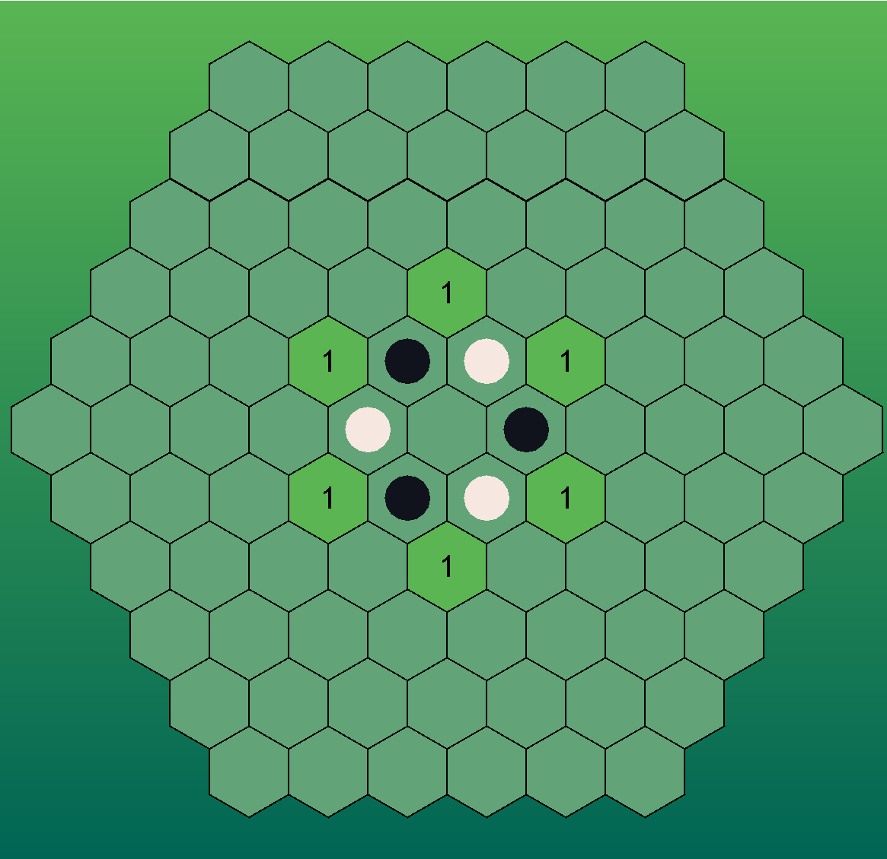
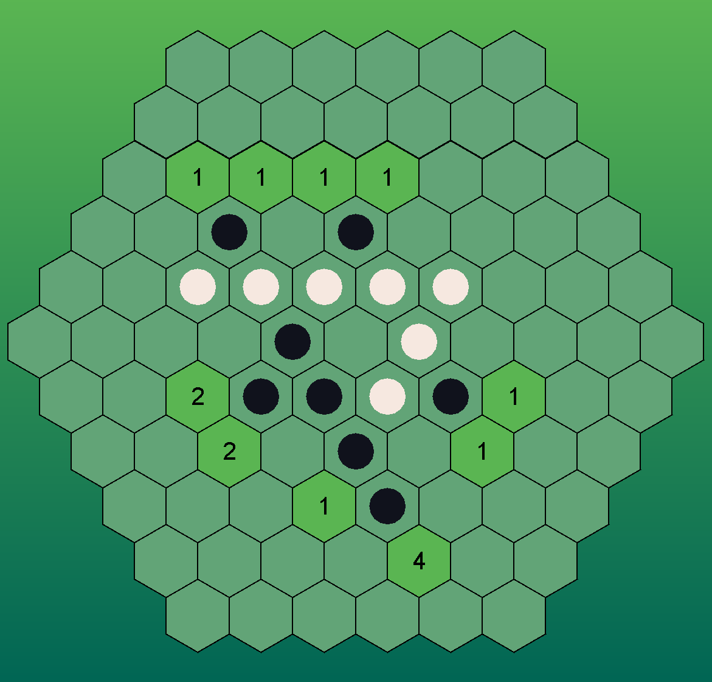
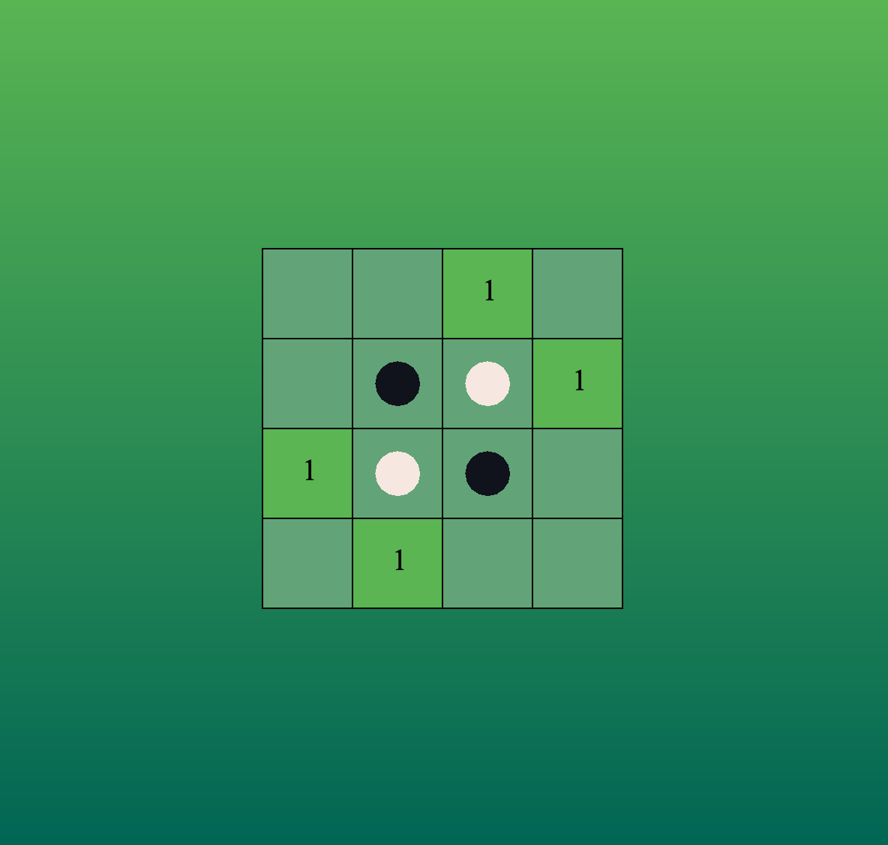
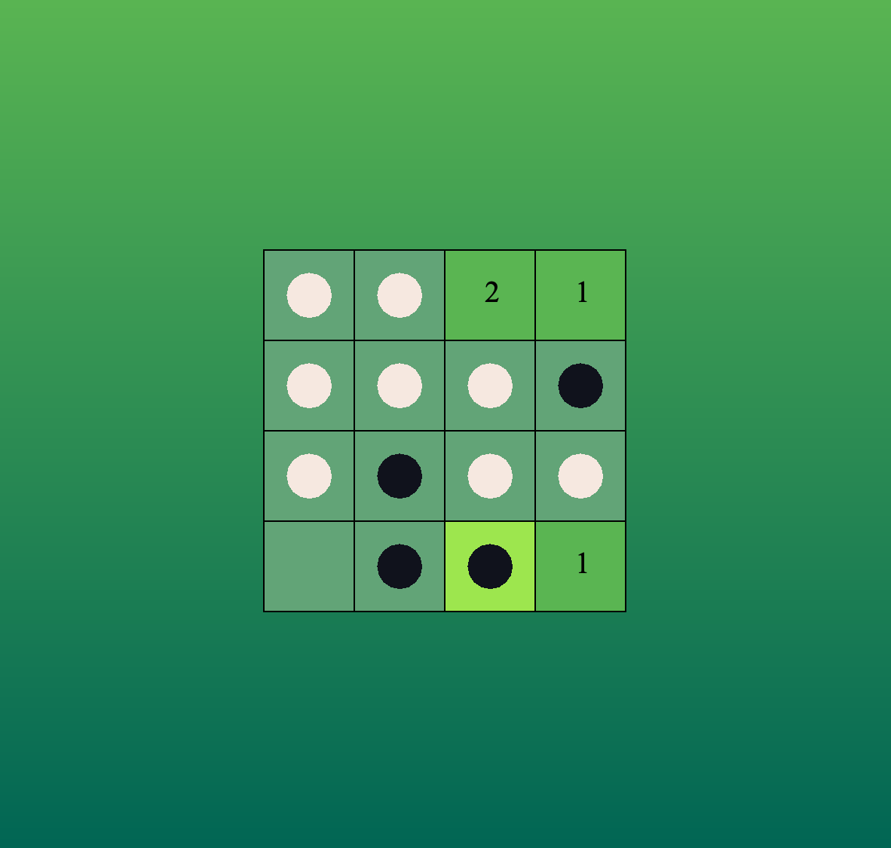
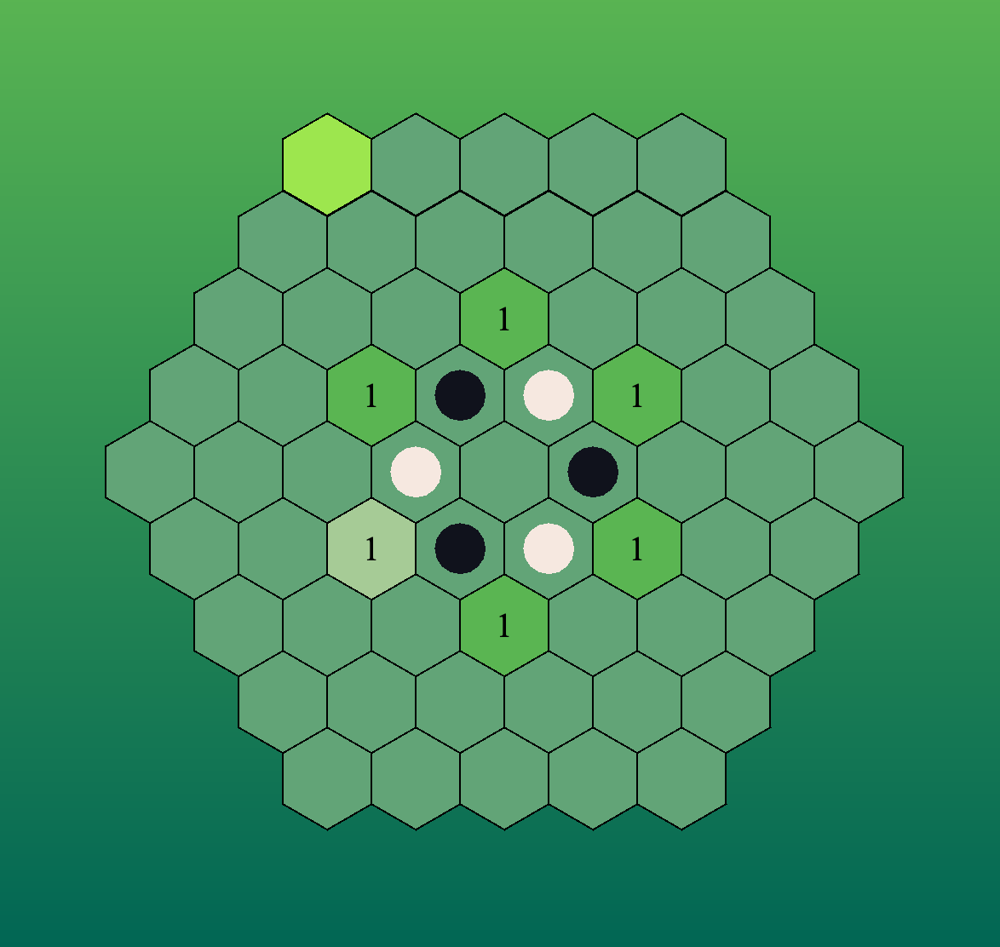
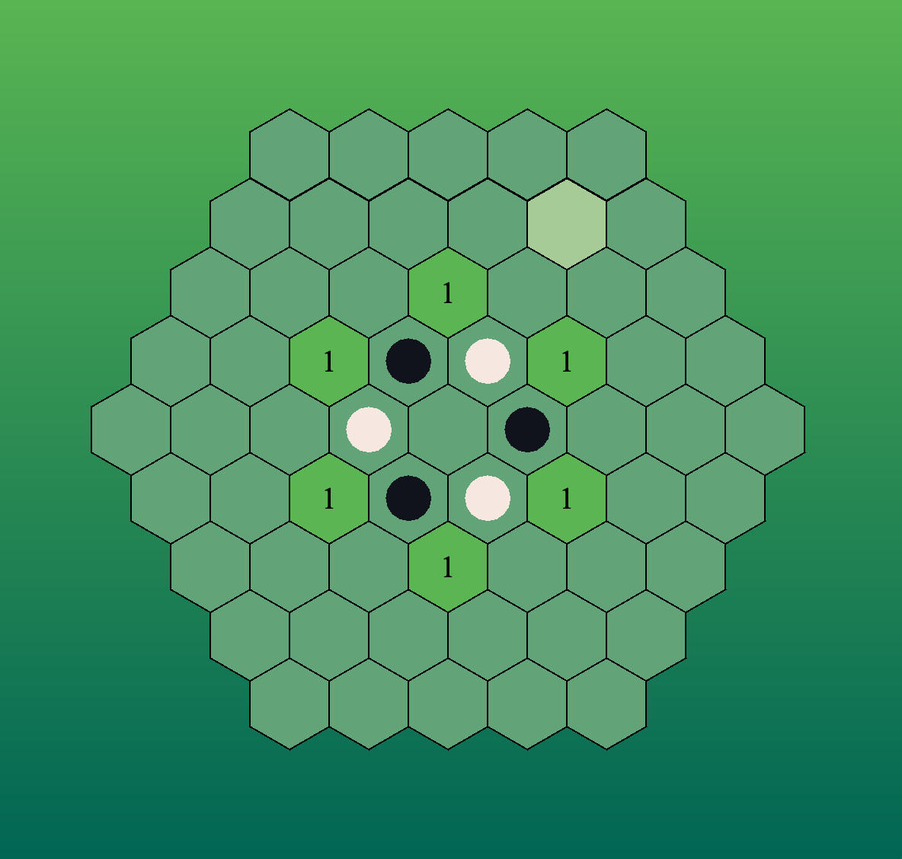
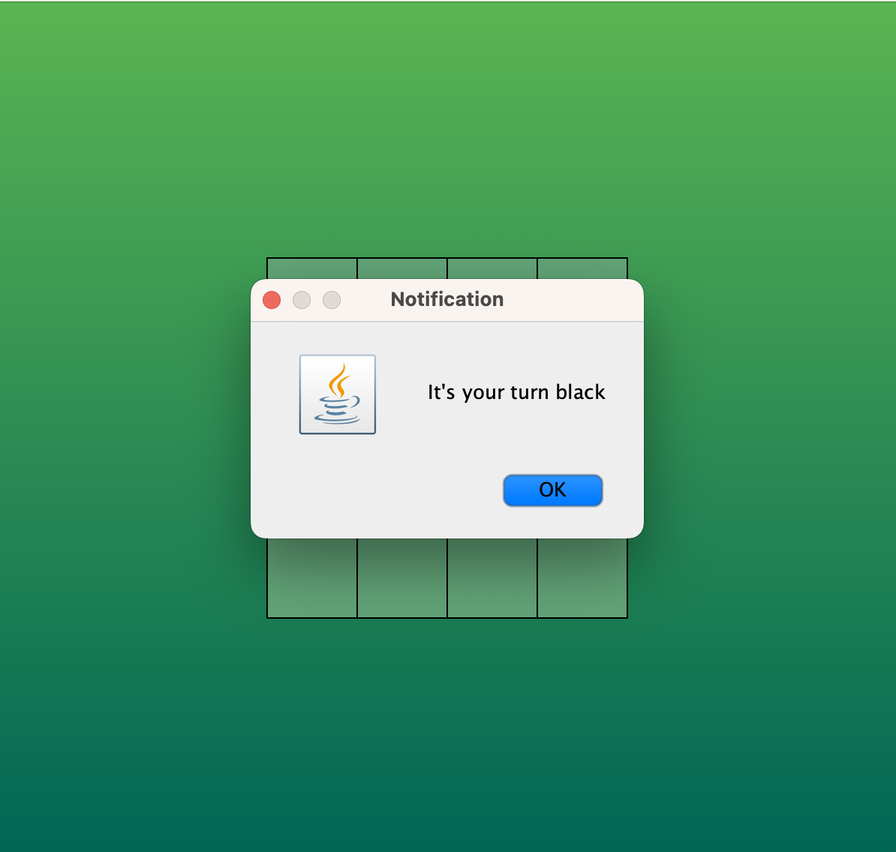
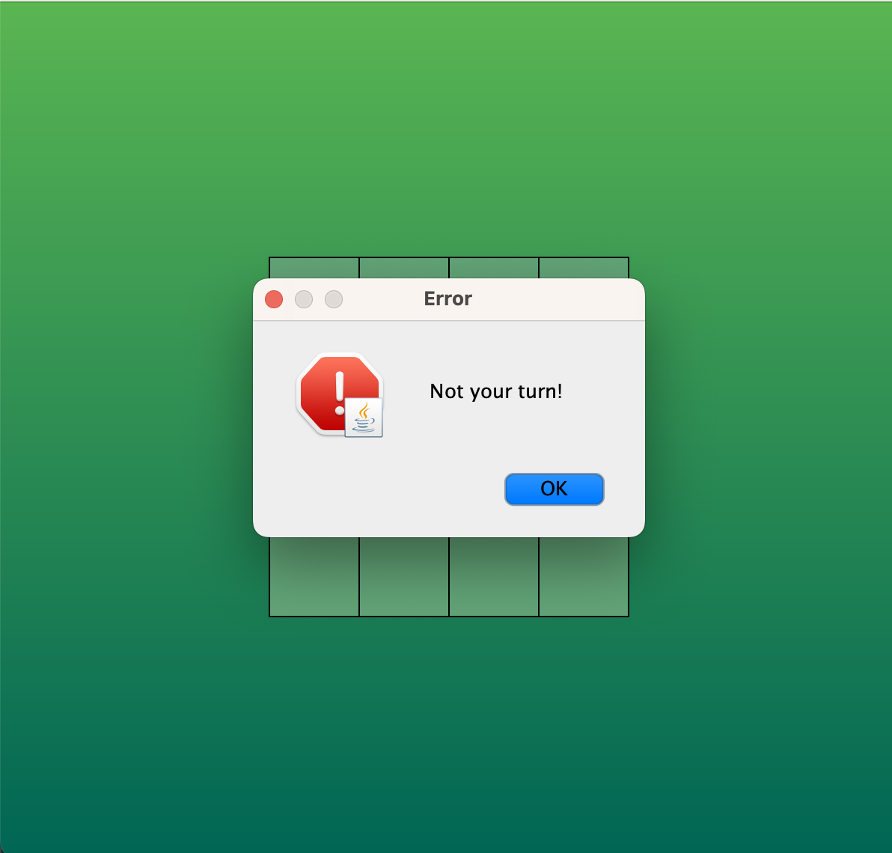
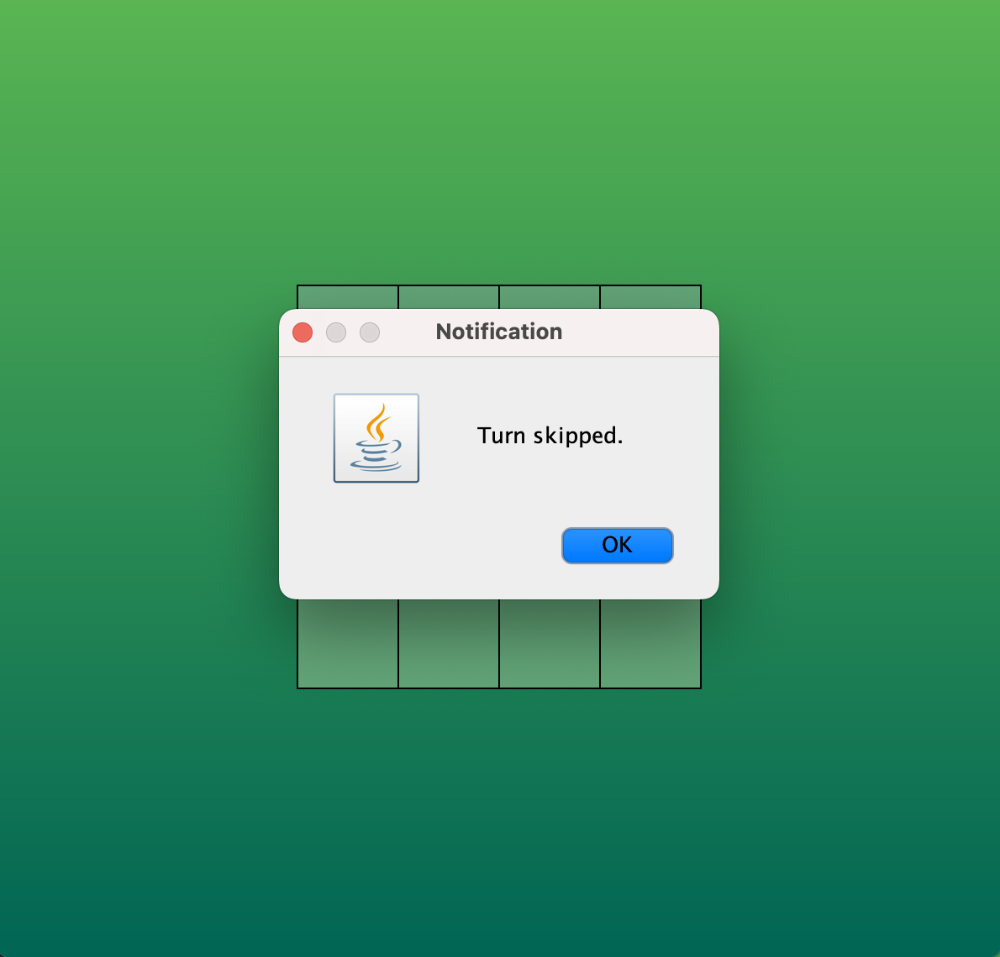
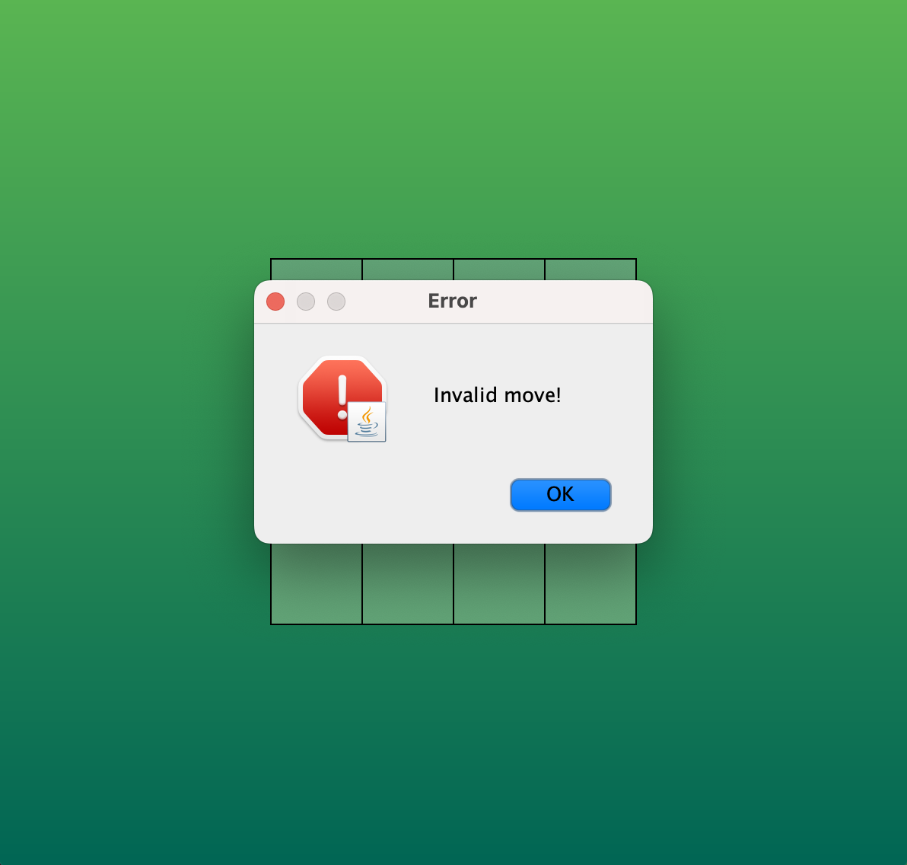

# Reversi Game

### *Full codebase available upon request*

Per Northeastern University CS3500 guidelines the full repository must remain private. Public available upon request at segal.jo@northeastern.edu

# Table of Contents

1. [Description](#description)
2. [Tech Base](#tech-base)
3. [Installation and Running](#installation-and-running)
4. [Usage](#usage)
5. [Key Features](#key-features)
6. [Screenshots](#screenshots)
7. [Collaboration](#collaboration)

## Description
The "Reversi Game" project aims to create a basic graphical representation of a Reversi game, featuring both hexagonal and square board layouts. Players can be human or computer, and any combination can play each other. The codebase assumes that the client is familiar with the rules of [Reversi](https://en.wikipedia.org/wiki/Reversi). It offers flexibility in terms of the board shape size, with all edges being of equal length. However, note that different starting positions and support for multiple players are beyond the scope of this codebase.

## Tech Base
- **Programming Language**: The Reversi game is coded entirely in `Java`, utilizing its object-oriented features and platform independence.
- **GUI Framework**: The graphical representation of the game is built using `Swing`, a lightweight Java GUI toolkit.
- **Libraries**: No third-party libraries were utilized in the development of the Reversi game, ensuring minimal dependencies and a streamlined codebase.
- **Version Control**: `Git` was employed for version control, allowing for efficient collaboration with team members.
- **Testing Frameworks**: `JUnit`, a Java testing framework, was used to ensure the correctness and reliability of the game's codebase through unit testing and mock testing.
- **Documentation Tools**: The codebase is well-commented to facilitate understanding and maintenance.

## Installation and Running
To install the Reversi Game, follow these steps:
1. Download the JAR file from the repository.
2. Navigate to the directory where the JAR file is located.
3. Run the following command in the terminal:
    ```
    java -jar reversi.jar [arg1] [arg2] [arg3] [arg4]
    ```
   Replace `[arg1]`, `[arg2]`, `[arg3]`, and `[arg4]` with your desired arguments
- `[arg1]` and `[arg2]` are the arguments for player 1 and 2 respectively: 
  - `humanPlayer` for human control.
  - maxFlip for a machine with the maxFlip strategy.
  - `avoidCorners` for a machine with the avoidCorners strategy.
  - `preferCorners` for a machine with the preferCorners strategy.
  - `minMaxMaxFlip` for a machine with the minMaxMaxFlip strategy.
  - `FallBackPreferCornerMaxFlip` for a machine with the PreferCorners
    combined with the MaxFlip strategy.
  - `[arg3]` is the size of the board, it must be greater
    than 1 to run at all, and greater than 2 to have any valid moves
    and be a "fun" game. **If you are playing a square game, the size must be even.**
  - `[arg4]` square for a square board, hex for hexagonal.

Please note that other arguments are not accepted and the game will not run. There are no dependencies required for this project.

## Usage

**Keyboard Inputs:** 
- keypress `Enter` is move and evaluates the move
  at the given selected cell with the current player.
- keypress `Space` is pass and passes to the next player's turn.

**Mouse inputs:**
- `Hovering` over a cell lights it up.
- `Clicking` on a cell "selects" that cell, lighting it up even brighter.
    - This then allows you to make a move by pressing `Enter` (see above).

## Key Features
- Graphical representation of the Reversi game
  - Both hexagonal and square board layouts utilizing change of coordinate system during compile time.
  - Supports board sizes > 1 for hex and square (square must be even for centering).
- Functional AI machine opponents with permutable strategy combinations including individual strategies and fallback mechanisms;
  - Individual: distinct algorithms tailored to evaluate game states and prioritize potential moves based on specific criteria such as amount of tiles flipped, corner occupancy, and minimax decision-making.
  - Fallback: employs a hierarchical strategy system to rank valid moves, iteratively passing evaluated moves between strategies to determine the most optimal move.
- Informative move graphics, including graphical representations of:
  -  Potential valid moves and the number of tiles that would flip upon executing each move, displayed at the center of each tile.
  -  Selected cell and hovered cell unique highlight color.

## Screenshots
## Gameplay:

#### Beginning of a hexagonal game of size 6:



#### Interesting middle state of a hexagonal game of size 6:



#### Beginning of a square game of size 4:



#### Interesting middle state of a square game of size 4:



## GUI Features:
#### Cell selected:



#### Cell hovered:



### Notifications:
Your turn:



Not your turn:



Turn skipped:



Invalid move:



Game over:


## Collaboration
This project is a result of collaboration between myself and my partner, [Max Bolz](https://github.com/maxbolz). We worked together on all aspects of the game, including design, implementation, and testing.
